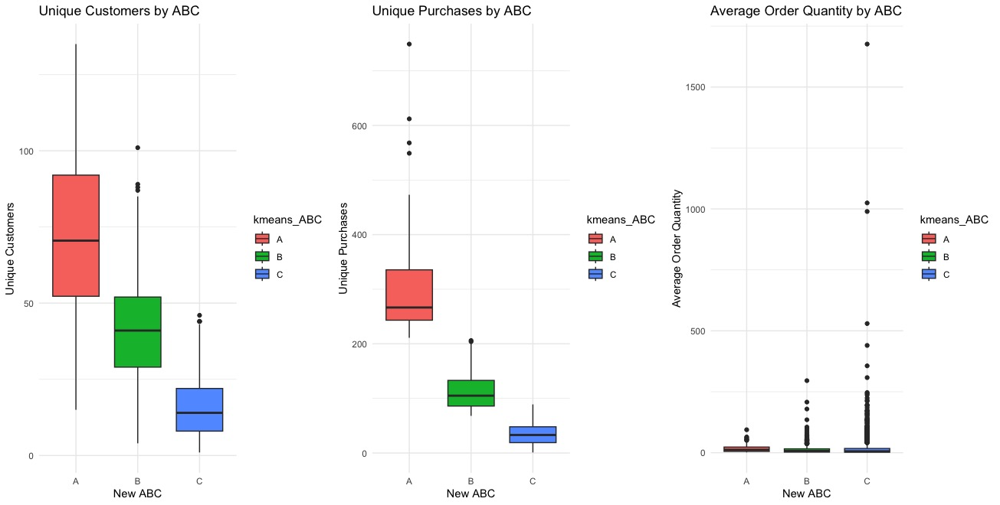
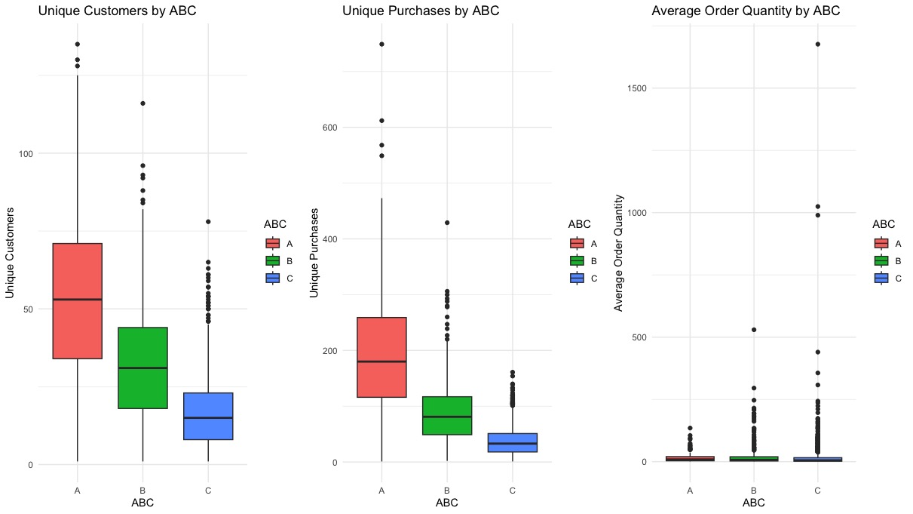

# Sidel Supply Chain Analytics: On-Time Delivery & Inventory Optimization

## 📌 Overview
Analyzes Sidel’s supply chain data to fix misalignment between HQ stocking policy and real demand at the Georgia DC. We used **regression** and **K-means clustering** to evaluate order timeliness and improve ABC categorization.

## 🎯 Business Problem
- HQ sets safety stock and **ABC categories** (A, B, C) that drive reorder levels.
- Misclassification ⇒ **overstock (rusting parts)** and **late shipments**.
- Goal: test categorization, explain drivers of on-time delivery (OTD), and point to a pull-based approach.

## 🛠️ Tools & Skills
Python (Pandas, NumPy, scikit-learn, Matplotlib), Multiple Linear Regression, Logistic Regression, K-means, Excel/PowerPoint.

## 📂 Data
Four years of SAP extracts (2019–2023): ABC catalog, sales orders, purchase orders, deliveries.  
Final modeling set ≈ **141,116 rows × 15 cols**.

## 🔍 Methods
1. **EDA & Join Logic** across orders, deliveries, and ABC data.
2. **MLR (10-fold CV)** to predict Turnaround Time (TAT = CRD − Ship Date).
3. **K-means (k=3)** on demand frequency & order size to recreate **A/B/C**.
4. **Logistic Regression** to model probability of OTD.

## 📈 Key Findings (high level)
- Average orders are on time, but variance is large; **C-parts** tend to ship slower.
- Example linear model form:
- **~24%** of items shift categories under K-means (evidence of misclassification).
- OTD is **positively related** to safety stock and **negatively related** to delivery quantity.

## 🖼️ Visuals
- 3D K-means clusters  

- New ABC boxplots (after clustering)  

- Original ABC boxplots (before)  

## 📑 Project Assets
- **EDA Notebook:** [`All Data - EDA.ipynb`](All%20Data%20-%20EDA.ipynb)  
- **Dataset (sample/export):** [`sidel_kmeansABC_df.csv`](sidel_kmeansABC_df.csv)  
- **Final Presentation (PPTX):** [`MGMT 6203_Final PPT Report.pptx`](MGMT%206203_Final%20PPT%20Report.pptx)

## 👤 Author
**Nora Perotti** — M.S. Analytics ’25 @ Georgia Tech (9+ yrs accounting → data analytics)  
[LinkedIn](https://www.linkedin.com/in/nora-p-91916b55/)

